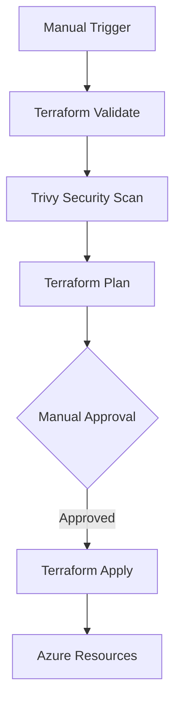
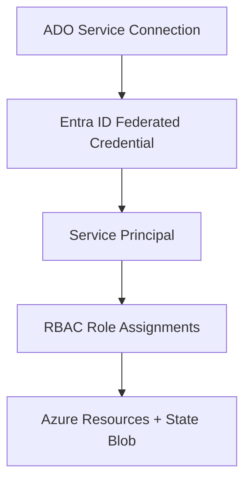

# Azure Terraform + DevOps Deployment Pipeline

Infrastructure-as-Code project that provisions an Azure Service Bus
namespace and queues via modular Terraform, deployed through an Azure
DevOps CI/CD pipeline with security scanning, manual approval gates,
multi-environment support, and scheduled drift detection.

## Table of Contents

- [Architecture](#architecture)
- [Tech Stack](#tech-stack)
- [Project Structure](#project-structure)
- [Prerequisites](#prerequisites)
- [Setup](#setup)
- [Terraform Modules](#terraform-modules)
- [CI/CD Pipelines](#cicd-pipelines)
- [Authentication & RBAC](#authentication--rbac)
- [Security](#security)
- [Extending the Project](#extending-the-project)
- [Roadmap](#roadmap)
- [Cost Management](#cost-management)

---

## Architecture

**Deploy flow**



**Authentication flow**



**Supporting pipelines**

- `drift-detection-pipeline.yml` — scheduled, read-only, checks both environments weekly
- `destroy-pipeline.yml` — manual, tears down a selected environment

---

## Tech Stack

| Component         | Choice                              |
| ----------------- | ----------------------------------- |
| IaC tool          | Terraform >= 1.13                   |
| Provider          | `hashicorp/azurerm` ~> 5.0          |
| CI/CD             | Azure DevOps Pipelines (YAML)       |
| Remote state      | Azure Blob Storage                  |
| Auth              | Workload Identity Federation (OIDC) |
| Security scanning | Trivy (IaC config scan)             |

---

## Project Structure

```
azure-terraform-devops/
├── terraform/
│   ├── modules/
│   │   ├── resource_group/
│   │   │   ├── main.tf
│   │   │   ├── variables.tf
│   │   │   └── outputs.tf
│   │   └── servicebus/
│   │       ├── main.tf
│   │       ├── variables.tf
│   │       └── outputs.tf
│   ├── env/
│   │   ├── dev.tfvars
│   │   └── prod.tfvars
│   ├── main.tf
│   ├── provider.tf
│   ├── variables.tf
│   ├── outputs.tf
│   └── backend.tf
├── pipelines/
│   └── templates/
│       ├── terraform-plan.yml
│       ├── terraform-apply.yml
│       └── terraform-destroy.yml
├── azure-pipelines.yml
├── drift-detection-pipeline.yml
├── destroy-pipeline.yml
└── README.md
```

---

## Prerequisites

- Azure subscription
- Azure DevOps organization and project
- Azure CLI (`az`)
- Git

---

## Setup

**1. Create the Service Principal**

```bash
az ad sp create-for-rbac --name "tfdemo-spn"
```

**2. Create the remote state backend**

```bash
az group create --name tfstate-rg --location centralindia

az storage account create \
  --name <unique-storage-account-name> \
  --resource-group tfstate-rg \
  --sku Standard_LRS \
  --kind StorageV2

az storage container create \
  --name tfstate \
  --account-name <unique-storage-account-name> \
  --auth-mode login
```

**3. Assign RBAC**

```bash
az role assignment create \
  --assignee-object-id <sp-object-id> \
  --assignee-principal-type ServicePrincipal \
  --role "Contributor" \
  --scope "/subscriptions/<subscription-id>"

az role assignment create \
  --assignee-object-id <sp-object-id> \
  --assignee-principal-type ServicePrincipal \
  --role "Storage Blob Data Contributor" \
  --scope "/subscriptions/<subscription-id>/resourceGroups/tfstate-rg/providers/Microsoft.Storage/storageAccounts/<unique-storage-account-name>"
```

**4. Configure Azure DevOps**

- Create a service connection (`Workload Identity Federation`) linked to the Service Principal
- Create two Environments: `dev`, `prod`, each with an approval check under **Approvals and checks**
- Import this repository into Azure Repos

**5. Create the pipelines**

| Pipeline entry  | YAML path                       |
| --------------- | ------------------------------- |
| Deploy          | `/azure-pipelines.yml`          |
| Drift Detection | `/drift-detection-pipeline.yml` |
| Destroy         | `/destroy-pipeline.yml`         |

**6. Run**

Run the Deploy pipeline with `environment = dev`, approve when prompted, verify resources in the Azure Portal. Repeat with `environment = prod`.

---

## Terraform Modules

### `modules/resource_group`

|         |                                 |
| ------- | ------------------------------- |
| Purpose | Creates a single resource group |
| Inputs  | `name`, `location`, `tags`      |
| Outputs | `id`, `name`, `location`        |

### `modules/servicebus`

|         |                                                                            |
| ------- | -------------------------------------------------------------------------- |
| Purpose | Creates a Service Bus namespace and a dynamic set of queues via `for_each` |
| Inputs  | `namespace_name`, `resource_group_name`, `location`, `sku`, `queues` (map) |
| Outputs | `namespace_id`, `namespace_name`, `queue_ids`, `queue_names`               |

Adding or removing a queue requires only a change to the `queues` map in the relevant `env/*.tfvars` file — no module code changes.

---

## CI/CD Pipelines

| Pipeline                       | Trigger                          | Stages                                             |
| ------------------------------ | -------------------------------- | -------------------------------------------------- |
| `azure-pipelines.yml`          | Manual (`environment` parameter) | Plan → Apply (approval-gated)                      |
| `drift-detection-pipeline.yml` | Scheduled (weekly cron)          | Plan-only, `-detailed-exitcode`, both environments |
| `destroy-pipeline.yml`         | Manual (`environment` parameter) | Destroy (approval-gated)                           |

**`terraform-plan.yml` template**

1. Install Terraform
2. Install Trivy
3. `terraform init` (environment-specific backend key)
4. `terraform fmt` / `terraform validate`
5. `trivy config .` — fails on HIGH/CRITICAL findings
6. `terraform plan -out=tfplan` (skipped in drift-check mode; see below)
7. Publish `tfplan` as a build artifact

**`terraform-apply.yml` template**

1. Download the published `tfplan` artifact
2. `terraform init`
3. `terraform apply tfplan` — applies the exact reviewed plan, not a re-generated one

**Drift detection logic**

Uses `terraform plan -detailed-exitcode` (`0` = no drift, `2` = drift, `1` = error). Before evaluating exit code `2` as drift, the pipeline runs `terraform state list`; an empty state is treated as "not yet deployed" and exits cleanly rather than reporting false-positive drift.

**Design notes**

- Validate, scan, and plan run in a single stage/job — Azure DevOps stages each provision a new agent, so merging read-only steps avoids redundant installs and re-authentication.
- Apply is a separate stage because Azure DevOps approval checks can only be attached to an Environment, which requires a `deployment` job.
- Destroy is a separate pipeline, not a flag on Deploy, to reduce the chance of accidental execution.

---

## Authentication & RBAC

**Identity model**

| Concept                 | Description                                                                 |
| ----------------------- | --------------------------------------------------------------------------- |
| Application (Client) ID | Identifies the app registration; constant across tenants                    |
| Object ID               | Identifies the tenant-local Service Principal; RBAC assignments target this |

**Authentication chain**

`ADO Service Connection (WIF)` → `Entra ID federated credential` → `Service Principal token` → authenticated `az` CLI session used by Terraform

No client secret is stored or rotated. `ARM_SUBSCRIPTION_ID` is exported at runtime from the authenticated session; `provider.tf` does not set `subscription_id` explicitly.

**Role assignments**

| Role                          | Scope                 | Purpose                                                   |
| ----------------------------- | --------------------- | --------------------------------------------------------- |
| Contributor                   | Subscription          | Create/manage/delete resources, including resource groups |
| Storage Blob Data Contributor | State storage account | Read/write Terraform state                                |

**Scope requirement:** Contributor is assigned at subscription level, not on a specific resource group. Role assignments scoped to a resource are deleted when that resource is deleted; since Terraform manages the full lifecycle of the resource group, the scope must sit above anything Terraform creates or destroys.

**Local execution:** Local Terraform runs authenticate as the operator's own Entra ID account and target the same remote backend as the pipeline. State and real resources are shared regardless of execution identity. Local `apply`/`destroy` against the shared backend bypasses the pipeline's approval gate and is not recommended.

---

## Security

- IaC misconfiguration scanning via Trivy, blocking on HIGH/CRITICAL severity
- No credentials or secrets committed to the repository — `.tfvars` files contain only resource configuration (names, regions, tags)
- Remote state access restricted via RBAC (`Storage Blob Data Contributor`)
- Manual approval required before `apply` or `destroy` in any environment

---

## Extending the Project

**Add a new resource module**

```
terraform/modules/<resource-name>/
├── main.tf
├── variables.tf
└── outputs.tf
```

Wire the module into `terraform/main.tf`, add corresponding variables to `terraform/variables.tf`, and supply values in each `env/*.tfvars` file. No pipeline changes required.

**Add a new environment**

1. Add `terraform/env/<environment>.tfvars`
2. Create a matching Environment in Azure DevOps with an approval check
3. Add the environment name to the `values:` list of the `environment` parameter in `azure-pipelines.yml` and `destroy-pipeline.yml`
4. Add a corresponding template call in `drift-detection-pipeline.yml`

---

## Roadmap

- Replace subscription-wide Contributor with a scoped custom role
- Add `terraform test` / Terratest coverage
- Pipeline failure and drift notifications (Teams/Slack/email)
- Module versioning via a private registry or Git tags
- Azure Cost Management budget alerts
- Branch protection and required review on `main`

---

## Cost Management

- Service Bus SKU: Basic (lowest cost tier supporting queues)
- All deploy/destroy pipelines are manual-trigger only
- Dedicated destroy pipeline for post-session cleanup
- State storage account: `Standard_LRS` replication
